# Enrollment and Secrets

When you enroll a cluster in Zen Mesh, zen-lock protects every piece of sensitive material. Here's how the enrollment flow uses zen-lock step by step.

## The Enrollment Bundle

When you click **Get install command** in the dashboard, the control plane generates an enrollment bundle. This bundle contains:

| Field | Purpose | Protection |
|-------|---------|------------|
| Tenant ID | Identifies your Zen Mesh account | Not secret — embedded in bundle |
| Cluster ID | Identifies your specific cluster | Not secret — embedded in bundle |
| Enrollment credentials | Proves cluster identity to control plane | **age-encrypted** |
| HMAC key | Signs events delivered to your cluster | **age-encrypted** |
| mTLS CA certificate | Root of trust for internal TLS | **age-encrypted** |

The bundle is encrypted with an age public key. Only the corresponding private key (held by the control plane) can decrypt it.

## Step-by-Step Flow

```mermaid
sequenceDiagram
    participant D as Dashboard
    participant K as kubectl apply
    participant A as zen-agent
    participant L as zen-lock

    rect rgb(30, 30, 50)
        Note over D: 1. Dashboard: Generate Bundle
        D->>D: Control plane creates bundle, encrypts with age
    end

    rect rgb(30, 30, 50)
        Note over K: 2. kubectl apply: Store in Cluster
        K->>K: Bundle stored as K8s Secret (ciphertext only)
        Note over K: zen-lock CRD references the Secret
        Note over K: etcd and API server only see encrypted data
    end

    rect rgb(30, 30, 50)
        Note over A: 3. zen-agent: Read and Decrypt
        A->>A: Read enrollment Secret
        A->>D: Present credentials to control plane
        D->>A: Verify and issue SPIFFE identity
    end

    rect rgb(30, 30, 50)
        Note over L: 4. zen-lock: Ongoing Secret Management
        L->>L: mTLS certificates injected ephemerally into egress pods
        L->>L: HMAC keys rotated automatically
        Note over L: All secrets stored as ciphertext CRDs
    end
```

## What Gets Stored Where

| Secret | Storage | Plaintext Exists? |
|--------|---------|-------------------|
| Enrollment bundle | K8s Secret (base64 of age ciphertext) | Only during agent startup |
| mTLS private key | zen-lock CRD (age ciphertext) | Only in egress pod memory |
| HMAC signing key | zen-lock CRD (age ciphertext) | Only in egress pod memory |
| SPIFFE/SPIRE certs | Short-lived, in-memory | Never persisted |

## Bundle Expiration

Enrollment bundles expire after **30 minutes**. If the bundle expires before you run the install command:

1. The old bundle is cryptographically invalid
2. Click **Regenerate** in the dashboard
3. A fresh bundle is created with new credentials
4. The old bundle is invalidated

This prevents stale enrollment bundles from being reused.

## After Enrollment

Once the cluster is enrolled, zen-lock continues managing secrets automatically:

- **Certificate rotation**: mTLS certs are rotated before expiry
- **Key rotation**: HMAC keys are rotated on a schedule
- **Orphan cleanup**: Ephemeral K8s Secrets are cleaned up when pods terminate

You never need to manually manage these secrets.
