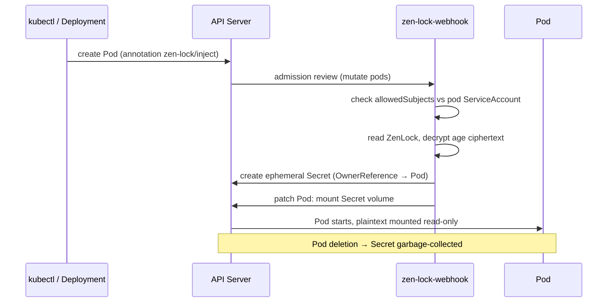

# How zen-lock Works

A technical deep dive into zen-lock's architecture, the encrypt/decrypt lifecycle, and the two delivery modes.

## Components

zen-lock ships as four binaries, deployed as Kubernetes workloads in the `zen-lock-system` namespace (or `zen-mesh` when installed as part of a Zen Mesh edge plane):

| Component | What it is | Role |
|-----------|-----------|------|
| `zen-lock` CLI | Developer tool (laptop/CI) | Generate age keys, encrypt secrets into `ZenLock` resources, drive key rotation |
| `zen-lock-webhook` | Deployment | Mutating admission webhook: decrypts at pod admission and injects ephemeral Secrets |
| `zen-lock-controller` | Deployment | Reconciles `ZenLock` status, performs re-encryption during key rotation, cleans up orphaned Secrets |
| `zen-lock-csi-provider` | DaemonSet (opt-in) | Secrets Store CSI driver provider: mounts secret files directly into pods, no Secret object |

A fifth component, `zen-lock-retrieval`, serves age-encrypted **signing key custody** to authorized Zen Trust workloads over mTLS — it is not part of standard secret delivery. See [High Availability](./high-availability#key-custody).

Webhook and controller are the same image with different flags (`--enable-webhook` / `--enable-controller`). The webhook scales horizontally; the controller uses leader election, so extra replicas stand by.

## The Encrypt Flow (Client Side)

Encryption happens **on your machine, before anything reaches the cluster**:

```bash
# 1. One-time: generate an age keypair
zen-lock keygen --output zen-lock-keys/key.txt
# prints the public key, e.g. age1ql3z...

# 2. Encrypt a Kubernetes Secret-style input into a ZenLock resource
zen-lock encrypt \
  --pubkey age1ql3z... \
  --input db-credentials.yaml \
  --output zenlock.yaml
```

The input is ordinary Secret-shaped YAML with `stringData`. The output is a `ZenLock` custom resource — every value is base64-encoded age ciphertext:

```yaml
apiVersion: security.zen-mesh.io/v1beta1
kind: ZenLock
metadata:
  name: db-credentials
  namespace: default
spec:
  algorithm: age
  encryptedData:
    DB_USER: <base64 age ciphertext>
    DB_PASS: <base64 age ciphertext>
```

Because the resource contains only ciphertext, you can commit it to Git, review it in a pull request, and replicate it through your GitOps tooling (Argo CD, Flux) without exposing anything.

## The Decrypt Flow — Webhook Injection

When a pod annotated for zen-lock is created:



Step by step:

1. A pod creation request hits the API server. The `zen-lock-mutating-webhook` intercepts it (`failurePolicy: Fail` — if the webhook is down, pod creation blocks rather than starting pods without secrets).
2. The webhook checks the pod for the `zen-lock/inject` annotation. No annotation, no action.
3. The webhook verifies the pod's ServiceAccount against the ZenLock's `allowedSubjects`. If the list is empty or doesn't include this ServiceAccount, injection is **denied**.
4. The ZenLock is fetched (cached, 5-minute TTL) and decrypted with the age private key held by the webhook.
5. An **ephemeral Secret** is created in the pod's namespace, labeled `zen-lock.security.zen-mesh.io/*` and owned by the pod via an OwnerReference.
6. The pod spec is patched to mount the Secret at `/zen-lock/secrets` (configurable), and the pod starts.

The decrypted Secret is **not permanent**:

- Created just before the pod starts
- Deleted automatically when the pod terminates (OwnerReference), with an orphan-TTL sweep (default 15 minutes) as a backstop
- Never written to Git; visible in `kubectl get secrets` only for the pod's lifetime

:::warning Webhook mode creates a real Secret
The ephemeral Secret is a standard Kubernetes Secret. Anyone with `get secrets` RBAC in the namespace can read its plaintext while the pod runs, and it is stored in etcd for its short lifetime. Enable etcd encryption-at-rest and restrict Secret RBAC, or use the [CSI driver](./csi-driver) if no Secret object may exist. See [Security Properties](./security-properties).
:::

## The Decrypt Flow — CSI Driver

In CSI mode there is no Secret object at all. The [Secrets Store CSI driver](https://secrets-store-csi-driver.sigs.k8s.io/) calls the zen-lock provider, which authorizes the pod (via a projected service-account token and a TokenReview), decrypts the ZenLock, and returns files that the CSI driver mounts into the pod as **read-only tmpfs**:

```
Pod volume (csi: secrets-store.csi.k8s.io)
  → SecretProviderClass (provider: zen-lock, zenlockName: …)
  → secrets-store CSI driver (node DaemonSet)
  → zen-lock-csi-provider (trusted nodes only)
      1. verify pod identity (TokenReview, audience zen-lock)
      2. enforce allowedSubjects
      3. fetch + decrypt ZenLock
  → read-only files mounted into the pod — no Secret created
```

CSI mode is opt-in per workload and per node: the provider DaemonSet only runs on nodes labeled `zen-lock.security.zen-mesh.io/csi-trusted: "true"`. The full setup, workload manifest, and security trade-offs are covered in [CSI Driver](./csi-driver).

## What Is Stored Where

| Location | Content | Plaintext? |
|----------|---------|------------|
| Git / GitOps repo | `ZenLock` resources | No — age ciphertext only |
| etcd (via API server) | `ZenLock` resources, ephemeral Secrets (webhook mode, pod lifetime only) | Ciphertext / plaintext for the mounted pod's lifetime |
| Pod filesystem | Mounted volume (webhook) or tmpfs (CSI), mode `0400` | Yes — that's the point of delivery |
| zen-lock pods | age private key (from the master-key Secret), plaintext in memory during decryption | Never logged, never persisted |

## Age Encryption

zen-lock uses [age](https://github.com/FiloSottile/age) (X25519) for all payload encryption:

- **Small attack surface**: one modern, well-audited primitive; no PKI, no algorithm negotiation
- **Client-side**: encryption happens outside the cluster entirely
- **Standard**: the same tooling ecosystem as SOPS and Flux
- **Dual-key rotation**: an active plus optional previous identity allow zero-downtime key rotation — see [Key Rotation](./key-rotation)

## What You'll See in Your Cluster

```bash
# Webhook and controller pods
kubectl get pods -n zen-lock-system

# Encrypted resources (ciphertext only)
kubectl get zenlocks -A
# NAME              PHASE   ROTATION   AGE
# db-credentials    Ready   idle       4d

# Ephemeral secrets (webhook mode; exist only while their pods run)
kubectl get secrets -n default \
  -l zen-lock.security.zen-mesh.io/zenlock-name=db-credentials
```

The API group is `security.zen-mesh.io` (v1beta1). Short names: `zenlock`, `zl`.
