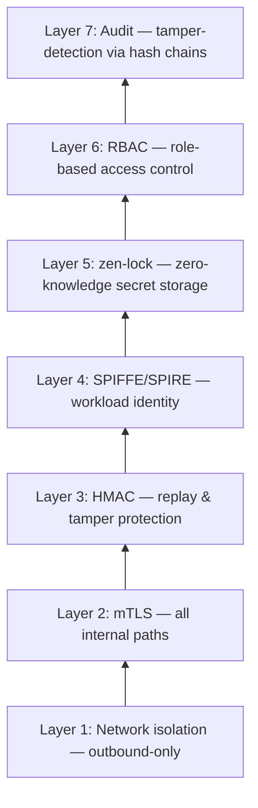

# Security Properties

What zen-lock protects against, what it doesn't, and how it fits into the overall security model.

## The Core Claim, Stated Precisely

Zero-knowledge applies to the `ZenLock` resource: the Kubernetes API server and etcd **cannot read the ZenLock payload** (ciphertext). Runtime delivery necessarily exposes plaintext **to the workload** and, in webhook mode, to any principal that can read the generated ephemeral Kubernetes Secret. zen-lock is not a hard security boundary against cluster-admin or node compromise — the tables below draw the exact line.

## Threats zen-lock Mitigates

### etcd Compromise

If an attacker gains read access to your cluster's etcd database:

| What they get | What they DON'T get |
|---------------|---------------------|
| ZenLock resources (ciphertext) | Plaintext enrollment credentials |
| Ephemeral Secrets that exist while pods run (webhook mode) | Plaintext HMAC keys |
| Pod specs, ConfigMaps | Plaintext mTLS private keys |
| Service accounts, RBAC | Zen Mesh delivery credentials |

Without the age private key — held outside the cluster, by you (standalone installs) or by the Zen Mesh control plane (platform installs) — the ciphertext is useless. CSI-mode workloads leave no plaintext Secret in etcd at all.

### Backup Compromise

Backups of your cluster (Velero, etcd snapshots) contain only ciphertext for ZenLock-managed material. A leaked backup does not expose the secrets.

### Git Repository Compromise

Committing ZenLock resources to Git is a supported workflow. A compromised repo reveals only ciphertext.

### Insider Threat (Cluster Admin)

A cluster administrator with `kubectl` access can:

- ✅ Read ZenLock resources (ciphertext — not useful)
- ✅ List pods, services, ConfigMaps
- ✅ Read ephemeral Secrets **while injected pods run** (webhook mode)
- ❌ Extract the age private key (never stored in the cluster)
- ❌ Receive secrets through a workload they don't control (empty/mismatched `allowedSubjects` denies at admission — there is no bypass)

## What zen-lock Does NOT Protect Against

| Threat | Why zen-lock doesn't help | Mitigation |
|--------|--------------------------|------------|
| Pod exec by cluster admin | Admin can exec into a running pod and read mounted secrets | RBAC, admission policies |
| Compromised Zen Mesh control plane (platform installs) | The control plane holds the age private key | Control-plane security, mTLS, SPIFFE |
| Memory dump of a running pod or the webhook | Plaintext exists in memory during runtime delivery | Node security, container isolation |
| Network sniffing within the cluster | Pod-to-pod traffic may be unencrypted | Network policies, service mesh |
| Stolen enrollment bundle | Bundle is encrypted, but valid during its TTL | Short TTL (30 min), one-time use |
| **Compromised CSI-trusted node** | The CSI provider on a trusted node holds the cluster age identity in memory and can decrypt **every** ZenLock — a wider blast radius than webhook mode | Restrict and harden trusted node pools; gate the `csi-trusted` node label with RBAC; prefer webhook mode on untrusted nodes |
| Plaintext Secret exposure (webhook mode) | The injected Secret is a standard Kubernetes Secret for the pod's lifetime | etcd encryption-at-rest, tight Secret RBAC, or [CSI mode](./csi-driver) |

## Explicit Non-Goals

zen-lock is deliberately not:

- A **dynamic secrets** system — no leased credentials, no database/cloud rotation
- A **centralized secrets platform** — no auth methods, policy engines, or audit devices
- A **provider sync operator** — the encrypted resource is the source of truth
- A **protection against cluster-admin** — see above

## zen-lock in the Zen Mesh Security Stack

zen-lock is one layer of a defense-in-depth model:

No single layer is sufficient on its own. zen-lock specifically addresses the **storage** threat: ensuring that persistent data (etcd, backups, Git) never contains plaintext secrets.

## Hardening Checklist

- [ ] Pre-create the master-key Secret; never ship the placeholder key
- [ ] Enable etcd encryption-at-rest (defense-in-depth for ephemeral Secrets)
- [ ] Restrict `get secrets` RBAC and the `zen-lock-master-key` Secret to the webhook/controller ServiceAccounts
- [ ] Set `allowedSubjects` on every ZenLock (empty denies all — keep it that way until you grant access)
- [ ] Rotate the master key on a schedule — see [Key Rotation](./key-rotation)
- [ ] If using the [CSI driver](./csi-driver): minimize trusted nodes, lock down node-label RBAC, enable the provider NetworkPolicy with explicit API-server CIDRs

## Compliance Notes

| Requirement | zen-lock Contribution |
|-------------|----------------------|
| **SOC2 CC6.1** (logical access) | Secrets not readable from etcd/API server |
| **SOC2 CC6.3** (data encryption) | age encryption at rest |
| **PCI DSS 3.4** (render PAN unreadable) | Sensitive fields encrypted before storage |
| **HIPAA** (ePHI protection) | Encryption at rest with access controls |
