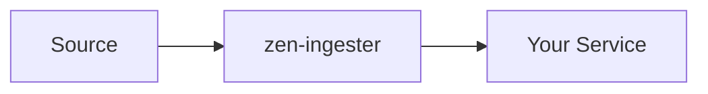
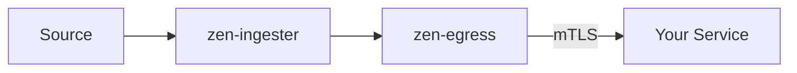
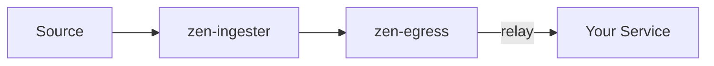
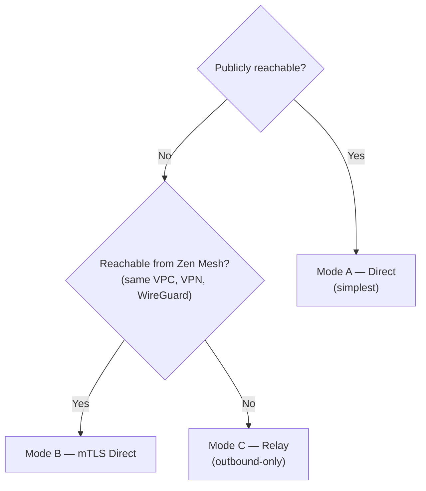

# Delivery Modes

Zen Mesh supports three delivery modes for different network topologies. Choose based on whether your target is publicly reachable, reachable from the ingester, or completely firewalled.

## Mode A — Direct Public Target

Use when: Your service has a public endpoint (even behind a load balancer).

| Property | Value |
|----------|-------|
| **Complexity** | Lowest |
| **Security** | HTTPS (source to ingester) + HTTPS (ingester to target) |
| **Network** | No special requirements |

This is the simplest mode. The ingester receives the event and forwards it to your public URL. No egress or agent required.

## Mode B — Egress Direct

Use when: Your service is private but reachable from the Zen Mesh data plane via mTLS.

| Property | Value |
|----------|-------|
| **Complexity** | Medium |
| **Security** | mTLS between ingester and egress, mTLS between egress and target |
| **Network** | Egress must be able to reach your cluster (or be in the same VPC) |

The egress proxy runs in your cluster and establishes an mTLS connection. Events are routed through this encrypted tunnel to your private services.

## Mode C — Egress Relay

Use when: Your service is behind NAT or a firewall with no inbound access.

| Property | Value |
|----------|-------|
| **Complexity** | Highest |
| **Security** | mTLS + HMAC-SHA256, outbound-only from your cluster |
| **Network** | Outbound connection only. No inbound ports required. |

The egress uses relay mode to connect through NAT/firewalls. Your cluster initiates the connection outward — nothing needs to be opened inbound.

## Choosing a Mode

## See Also

- [Cluster Enrollment](../guides/cluster-enrollment) — Set up your cluster for Mode B/C
- [Security Model](./security-model) — How mTLS and HMAC protect each mode
