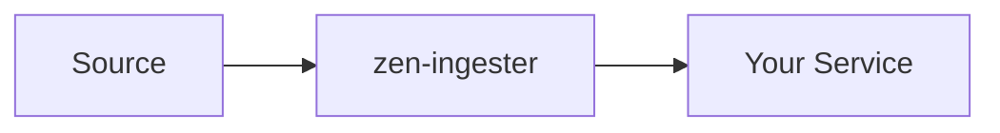
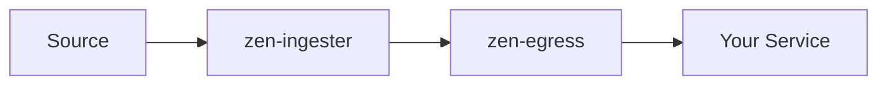

# Delivery Modes

Zen Mesh supports two delivery modes for different network topologies.

## Standard delivery

```mermaid
graph LR
    SRC[Source] --> ING[zen-ingester] --> TGT[Your Service]
```

Use when the destination is reachable from the selected Zen Mesh data plane.

| Property | Value |
|---|---|
| **Complexity** | Lowest |
| **Security** | HTTPS (source to ingester) + TLS (ingester to target) |
| **Network** | No special requirements. Destination must be reachable from the data plane. |

This is the default mode and the simplest to set up. The ingester receives the event and forwards it to your destination. No egress or edge enrollment required.

## Outbound-only private delivery

```mermaid
graph LR
    SRC[Source] --> ING[zen-ingester] --> EGR[zen-egress] --> TGT[Your Service]
```

Use when the destination is behind NAT or a corporate firewall and an enrolled edge adapter can maintain an outbound relay connection.

| Property | Value |
|---|---|
| **Complexity** | Medium |
| **Security** | mTLS between ingester and egress, mTLS or TLS between egress and target |
| **Network** | Outbound connection from the edge adapter to Zen Mesh. No inbound ports required. |

The egress component runs in your environment and establishes an outbound connection to the Zen Mesh data plane. Events are tunneled through this connection to your private services without opening any inbound firewall ports.

## Choosing a mode

Zen Mesh uses **Standard delivery** by default. The system does not silently auto-detect the mode in V1. If your destination is private and requires relay-based delivery, select **Outbound-only private delivery** when configuring the destination.

Relay selection is gated by selected data-plane capability and edge enrollment readiness.

Default is **Standard delivery**.

## See Also

- [Quick Start](../getting-started/quick-start) — create your first endpoint
- [Security controls](../security/) — mTLS, HMAC, and header validation
