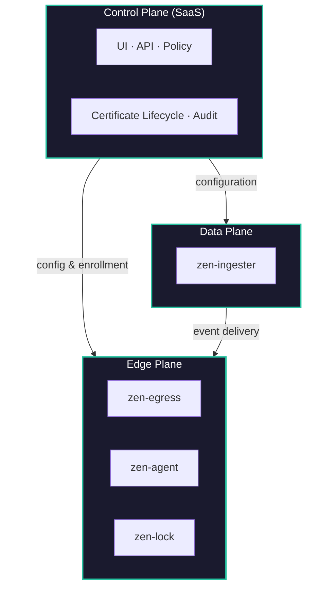

# Architecture Overview

Zen Mesh uses a **three-plane architecture** that separates control from runtime delivery. The SaaS control plane is **never in the data path** — events flow directly through the data plane.

## The Three Planes

## Design Principles

### Outbound-Only

Your cluster never receives inbound connections. All delivery is outbound from your infrastructure. No firewall changes, no VPN, no exposed ports.

### Enrollment-Based Identity

Trust starts with enrollment — a cryptographic bundle exchange during cluster registration. Identity is never configured manually. Short-lived credentials auto-rotate.

### SaaS-Optional Runtime

After enrollment, the data plane continues operating even if the control plane is temporarily unavailable. Delivery does not depend on the SaaS being up.

### Zero-Knowledge Secrets

Sensitive material (enrollment credentials, HMAC keys, mTLS certificates) is managed by [zen-lock](/zen-lock/), a zero-knowledge secret manager. Only ciphertext is stored; decryption happens at runtime in ephemeral sidecar injection.

## Key Components

| Component | Plane | Purpose |
|-----------|-------|---------|
| **zen-back** | Control | API server, tenant management, RBAC |
| **zen-bff** | Control | Backend-for-frontend, session management |
| **zen-front** | Control | React UI, dashboard |
| **zen-ingester** | Data | Public HTTP intake, CloudEvents format |
| **zen-egress** | Edge | Event dispatch to private targets via mTLS |
| **zen-agent** | Edge | Cluster enrollment, heartbeat, config sync |
| **zen-lock** | Edge | Zero-knowledge secret management |

## See Also

- [Three-Plane Model](./three-plane-model) — Deep dive into the separation
- [Delivery Modes](./delivery-modes) — How events reach private targets
- [Security Model](./security-model) — mTLS, HMAC, SPIFFE, enrollment trust
