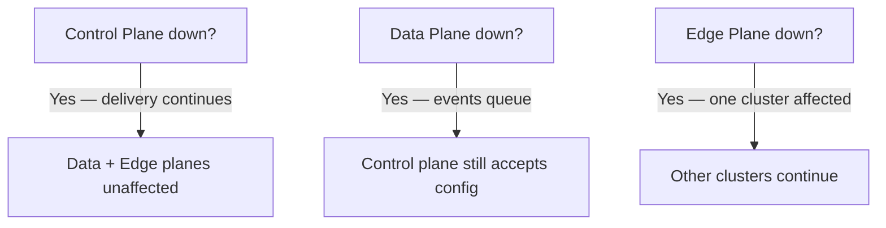

# Three-Plane Model

The three-plane architecture is the core design decision that differentiates Zen Mesh from competitors like Hookdeck, Svix, and ngrok.

## Why Three Planes?

Most webhook platforms put their SaaS service **in the delivery path**: `Source → SaaS → Your Service`. This creates latency, single points of failure, and privacy concerns (your data flows through a third party).

Zen Mesh splits this into three independent planes:

| Plane | Responsibility | Failure Domain |
|-------|---------------|----------------|
| **Control Plane** | Configuration, UI, policy, certificates | If down: no config changes, delivery continues |
| **Data Plane** | Event routing, retry, backpressure | If down: events queue until recovery |
| **Edge Plane** | Local delivery, secret injection, adapters | If down: only affected cluster stops receiving |

## Control Plane (SaaS)

The control plane is what you see in the dashboard: create clusters, configure destinations, manage API keys, view delivery logs.

**It never sees your event payloads.** The control plane handles enrollment and configuration only. Once a cluster is enrolled and destinations are configured, events flow directly through the data plane.

Components: `zen-back`, `zen-bff`, `zen-front`

## Data Plane

The data plane is the runtime delivery engine:

1. **zen-ingester** receives events from external sources (Stripe, GitHub, etc.)
2. **zen-bridge** routes events to the correct cluster and destination
3. **zen-egress** delivers events to services in your private cluster via mTLS

The data plane operates independently of the control plane. If the SaaS dashboard goes down, already-configured delivery continues uninterrupted.

## Edge Plane

The edge plane runs **in your cluster**:

- **zen-agent** handles enrollment, heartbeats, and configuration sync
- **zen-lock** manages secrets with zero-knowledge encryption
- **Adapters** (Splunk, PagerDuty, etc.) receive delivered events

The edge plane is the only component that has direct access to your private services. Everything else stays outside your cluster boundary.

## Independence Guarantees

This is fundamentally different from platforms where the SaaS service is the delivery engine. In Zen Mesh, the SaaS is the **control panel**, not the **delivery engine**.
