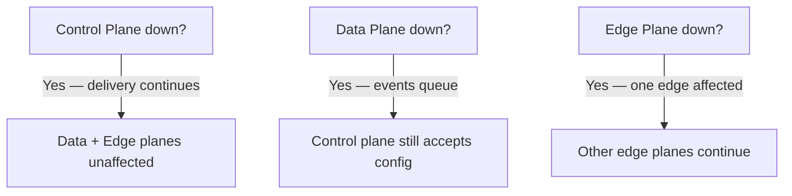

# Three-Plane Model

**Status:** PUBLIC_CONTRACT_DRAFT — The three-plane architecture is the core design decision that differentiates Zen Mesh from platforms where the SaaS service sits in the delivery path.

See [Planes](../concepts/planes) for the current architecture model including Edge Lite.

## Why Three Planes?

Most webhook platforms put their SaaS service **in the delivery path**: `Source → SaaS → Your Service`. This creates latency, single points of failure, and privacy concerns (your event data flows through a third party).

Zen Mesh splits this into three independent planes:

| Plane | Responsibility | Failure Domain |
|---|---|---|
| **Control Plane** | Configuration, UI, policy, certificates | If down: no config changes, delivery continues |
| **Data Plane** | Event routing, retry, backpressure | If down: events queue until recovery |
| **Edge Plane** | Local delivery, secrets, adapters | If down: only affected edge plane stops receiving |

## Control Plane (SaaS)

The control plane is what you see in the dashboard: create edge planes, configure endpoints and targets, manage delivery flows, view delivery logs.

**It never sees your event payloads.** The control plane handles enrollment and configuration only. Once an edge plane is enrolled and flows are configured, events flow directly through the data plane.

## Data Plane

The data plane is the runtime delivery engine:

- **zen-ingester** receives events from external sources (Stripe, GitHub, etc.)
- **zen-egress** delivers events to targets
- **zen-bridge** handles internal data-plane routing

The data plane operates independently of the control plane. If the SaaS dashboard goes down, already-configured delivery continues uninterrupted.

## Edge Plane

The edge plane runs in the **customer environment**:

- **zen-agent** handles enrollment, heartbeats, and configuration sync
- **zen-egress** (optional) delivers events to services in your private network
- **zen-ingester** (optional) receives events locally
- **zen-lock** manages secrets where applicable

The edge plane is the only component that has direct access to your private services. Everything else stays outside your network boundary.

**Edge Plane variants:**
- **[Kubernetes Edge Plane](../install/kubernetes-edge-plane)** — runs on your Kubernetes cluster
- **[Edge Lite](../install/edge-lite)** — lightweight non-Kubernetes runtime

### Connection Model

```
Edge Plane → Control Plane: outbound only (HTTPS + mTLS)
Edge Plane → Data Plane: outbound only (HTTPS + mTLS)
Control Plane → Edge Plane: never initiates
```

## Independence Guarantees


```mermaid
flowchart TD
    CP["Control Plane down?"] -->|"Yes — delivery continues"| DP["Data + Edge planes unaffected"]
    DP2["Data Plane down?"] -->|"Yes — events queue"| CP2["Control plane still accepts config"]
    EP["Edge Plane down?"] -->|"Yes — one edge affected"| OTH["Other edge planes continue"]
```

This is fundamentally different from platforms where the SaaS service is the delivery engine. In Zen Mesh, the SaaS is the **control panel**, not the **delivery engine**.

## Related

- [Planes: Control, Data, Edge, Edge Lite](../concepts/planes)
- [Kubernetes Edge Plane](../install/kubernetes-edge-plane)
- [Edge Lite](../install/edge-lite)
- [Data Plane](../install/data-plane)

## Evidence

Don't just take our word for the architecture. Zen's public claims are mapped to machine-readable discovery, security posture, evidence, and non-claim surfaces. **Narrative docs are not proof** — use the links below to verify scope, maturity, and explicit non-claims.

- [llms.txt](../llms.txt) — discovery index for agents and reviewers
- [Stable evidence manifest](../ai/evidence/v1/manifest.json) — canonical stable channel; always reflects current v1.1 truth
- [Stable non-claims](../ai/evidence/v1/non-claims.json) — canonical stable non-claims channel
- [Current v1.1 evidence manifest](../ai/evidence/v1.1/manifest.json) — frozen-green baselines (L1 Foundation, L2 Connect, Traffic engine) with proof_status and non-claims per capability
- [AI discovery registry](../ai/evidence-v1-supersession.md#ai-discovery-registry) — per-surface freshness (security vs capability inventory)
- [Claim maturity](ai/security-posture.md) — what is wired, tested, backlog, or not claimed
- [Security primitives](ai/security-posture.md) — primitive-level posture and boundaries
- [Security gaps](ai/security-posture.md) — visible backlog; gaps are not hidden as product claims
- [Capability supersession](../ai/evidence-v1-supersession.md#manifest) — proof_status and evidence scope per capability; superseded evidence stays historical
- [Non-claims](../ai/evidence-v1-supersession.md#non-claims) — what Zen Mesh does **not** claim

**Claim boundaries:** Integrity receipts are **integrity / tamper evidence only** — not authentication, encryption, or replay prevention. Idempotency helps detect and limit duplicates; it is **not** replay-proof delivery.
