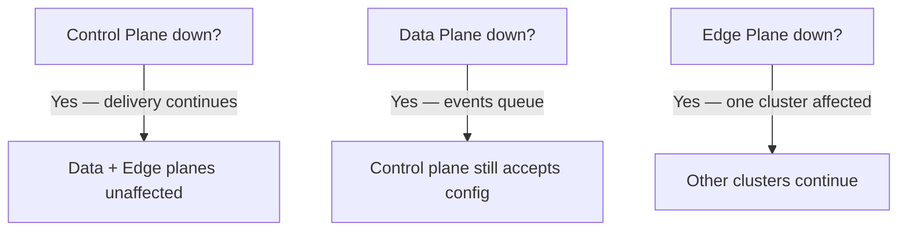

# Three-Plane Model

The three-plane architecture is the core design decision that differentiates Zen Mesh from competitors like Hookdeck, Svix, and ngrok.

## Why Three Planes?

Most webhook platforms put their SaaS service **in the delivery path**: `Source → SaaS → Your Service`. This creates latency, single points of failure, and privacy concerns (your data flows through a third party).

Zen Mesh splits this into three independent planes:

| Plane | Responsibility | Failure Domain |
|-------|---------------|----------------|
| **Control Plane** | Configuration, UI, policy, certificates | If down: no config changes, delivery continues |
| **Data Plane** | Event routing, retry, backpressure | If down: events queue until recovery |
| **Edge Plane** | Local delivery, secret injection, adapters | If down: only affected cluster stops receiving |

## Control Plane (SaaS)

The control plane is what you see in the dashboard: create clusters, configure destinations, manage API keys, view delivery logs.

**It never sees your event payloads.** The control plane handles enrollment and configuration only. Once a cluster is enrolled and destinations are configured, events flow directly through the data plane.

## Data Plane

The data plane is the runtime delivery engine:

1. **zen-ingester** receives events from external sources (Stripe, GitHub, etc.)

The data plane operates independently of the control plane. If the SaaS dashboard goes down, already-configured delivery continues uninterrupted.

## Edge Plane

The edge plane runs **in your cluster**:

- **zen-egress** delivers events to services in your private cluster via mTLS
- **zen-agent** handles enrollment, heartbeats, and configuration sync
- **zen-lock** manages secrets with zero-knowledge encryption

The edge plane is the only component that has direct access to your private services. Everything else stays outside your cluster boundary.

## Independence Guarantees

```mermaid
flowchart TD
    CP["Control Plane down?"] -->|"Yes — delivery continues"| DP["Data + Edge planes unaffected"]
    DP2["Data Plane down?"] -->|"Yes — events queue"| CP2["Control plane still accepts config"]
    EP["Edge Plane down?"] -->|"Yes — one cluster affected"| OTH["Other clusters continue"]
```

This is fundamentally different from platforms where the SaaS service is the delivery engine. In Zen Mesh, the SaaS is the **control panel**, not the **delivery engine**.

## Evidence

Don’t just take our word for the architecture. Zen’s public claims are mapped to machine-readable discovery, security posture, evidence, and non-claim surfaces. **Narrative docs are not proof** — use the links below to verify scope, maturity, and explici../ai/evidence-v1-supersession.md#non-claims.

- [llms.txt](../llms.txt) — discovery index for agents and reviewers
- [AI discovery registry../ai/evidence-v1-supersession.md### AI Discovery Registry) — per-surface freshness (security vs capability inventory)
- [Claim maturity](ai/security-posture.md) — what is wired, tested, backlog, or not claimed
- [Security primitives](ai/security-posture.md) — primitive-level posture and boundaries
- [Security gaps](ai/security-posture.md) — visible backlog; gaps are not hidden as product claims
- [Capability manifest../ai/evidence-v1-supersession.md#manifest) — proof_status and evidence scope per capability
- [Non-claims../ai/evidence-v1-supersession.md## non-claims) — what Zen Mesh does **not** claim

**Claim boundaries:** Hash-chain and Merkle receipts are **integrity / tamper evidence only** — not authentication, encryption, or replay prevention. Idempotency helps detect and limit duplicates; it is **not** replay-proof delivery.
