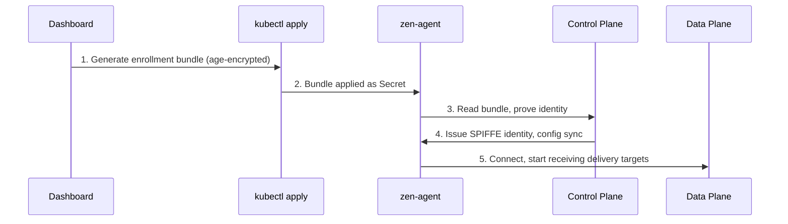

# Cluster Enrollment

Cluster enrollment is the process of registering your Kubernetes cluster with the Zen Mesh control plane. Once enrolled, the agent receives configuration, connects to the data plane, and starts delivering events to your services.

## How Enrollment Works



The enrollment bundle is single-use and time-limited (typically 30 minutes). If it expires, generate a new one from the dashboard.

## Enrolling a Cluster

### 1. Create the Cluster in the Dashboard

Navigate to **Clusters** → **Add Cluster** → enter a name → **Create**.

### 2. Generate the Install Command

Click **Get install command** on your cluster. The modal shows a single command with two steps:

1. Apply the enrollment secret (Kubernetes Secret with age-encrypted bundle)
2. Install zen-agent via Helm

Click **Copy all** to copy the entire command.

### 3. Run on Your Cluster

```bash
# Paste the copied command into a terminal with kubectl access
# The command applies the enrollment secret, then installs the agent
```

### 4. Verify

- The cluster status in the dashboard changes to **Connected**
- Agent logs show successful enrollment:
  ```bash
  kubectl logs -n zen-mesh -l app=zen-agent --tail=20
  ```

## Regenerating the Bundle

If the enrollment bundle expires before you use it:

1. Click **Regenerate** in the enrollment modal
2. A new bundle is generated (old one is invalidated)
3. Copy and run the new command

## What Gets Deployed

| Component | Namespace | Purpose |
|-----------|-----------|---------|
| zen-agent | zen-mesh | Enrollment, heartbeat, config sync |
| zen-egress | zen-mesh | Event delivery to private services |
| zen-lock | zen-mesh | Zero-knowledge secret management |

## Troubleshooting

| Problem | Solution |
|---------|----------|
| Bundle expired | Regenerate from the dashboard |
| Agent shows "Not Connected" | Check network: agent needs outbound HTTPS to `api.zen-mesh.io` |
| mTLS handshake failure | Check that `zen-lock` is running and certificates have been issued |
| Enrollment rejected | Verify the bundle matches the cluster ID in the dashboard |
