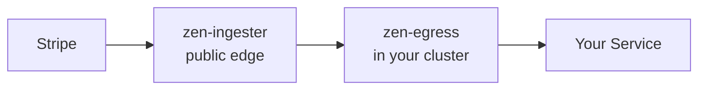

# Zen Mesh Documentation

**Secure webhook delivery to private networks — without opening firewalls.**

Zen Mesh connects external services (Stripe, GitHub, Slack, Shopify) to your private infrastructure using an **outbound-only** architecture. No VPN, no ngrok, no inbound ports.

## What is Zen Mesh?

Your cluster never receives inbound connections. All traffic flows outward from your infrastructure to the ingester, which then delivers events to your services.

## Key Concepts

- **Control Plane** — The SaaS UI where you configure destinations, manage clusters, and monitor delivery
- **Data Plane** — The runtime event intake: ingester receives events from external sources
- **Edge Plane** — Runs in your cluster: egress delivers to your services, agent handles enrollment, lock protects secrets
- **Adapters** — Connectors for external services (Splunk, PagerDuty, Grafana, Teams, etc.)

## Quick Links

| Resource | Link |
|----------|------|
| **Quick Start** | [Get started in 5 minutes](./getting-started/quick-start) |
| **Architecture** | [Three-plane model](./architecture/overview) |
| **Cluster Enrollment** | [Install the agent](./guides/cluster-enrollment) |
| **Adapters** | [Connect external services](./guides/adapters) |
| **Helm Charts** | [Chart reference](./reference/helm-chart) |

## Delivery Modes

Zen Mesh supports three delivery modes, all proven and validated:

| Mode | Path | Best For |
|------|------|----------|
| **A** — Direct Public Target | Source → Ingester → Target | Targets with public endpoints |
| **B** — Egress Direct | Source → Ingester → Egress → Target | Targets reachable from ingester via mTLS |
| **C** — Egress Relay | Source → Ingester → Egress (relay) → Target | Targets behind NAT/firewall |

## Need Help?

- **Discord**: [Join the community](https://discord.com/invite/clawd)
- **GitHub**: [Report issues](https://github.com/zenmesh/zen-platform/issues)
- **Website**: [zen-mesh.io](https://zen-mesh.io)
