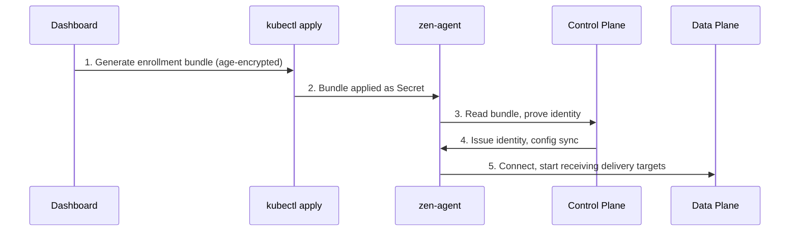

# Kubernetes Edge Plane Enrollment

**Status:** WIRED_SANDBOX — This page describes registering a Kubernetes-backed Edge Plane with the Zen Mesh control plane. This is one deployment model, not the product root.

## Overview

A Kubernetes Edge Plane is an edge plane running in your **Kubernetes cluster**. The cluster is a **deployment substrate** for the edge plane, not the primary product object. The Zen Mesh product model is plane-based.

Once enrolled, the edge plane connects outbound to the control plane for configuration and to the data plane for event delivery.

## How Enrollment Works



The enrollment bundle is single-use and time-limited (typically 30 minutes). If it expires, generate a new one from the dashboard.

## Before You Start

- A Kubernetes cluster with `kubectl` access
- Helm 3 installed
- Outbound HTTPS access to `api.zen-mesh.io`

## 1. Register an Edge Plane

Navigate to the dashboard: **Edge Planes** → **Add Edge Plane** → enter a name → **Create**.

## 2. Generate the Install Bundle

Click **Get install command** on your edge plane. The modal shows a command that:

1. Applies the enrollment secret (Kubernetes Secret with age-encrypted bundle)
2. Installs zen-agent via Helm

Copy the entire command.

## 3. Run on Your Kubernetes Cluster

```bash
# Paste the copied command into a terminal with kubectl access
```

## 4. Verify

- The edge-plane status in the dashboard changes to **Connected**
- Agent logs show successful enrollment:
  ```bash
  kubectl logs -n zen-mesh -l app=zen-agent --tail=20
  ```

## Optional Components

After enrollment, you can add:

| Component | Purpose | When to Use |
|---|---|---|
| zen-ingester | Receive events locally within your edge plane | Higher throughput or local-first processing |
| zen-egress | Deliver events to private services within your network | Services behind NAT or firewall |

## What Gets Deployed

| Component | Namespace | Role | Required? |
|---|---|---|---|
| zen-agent | zen-mesh | Enrollment, heartbeat, config sync | Required |
| zen-egress | zen-mesh | Event delivery to private services | Optional |
| zen-lock | zen-mesh | Secret management (zero-knowledge) | Per install path |

zen-bridge is not deployed in the edge plane — it runs in the data plane.

## How It Connects

- **Outbound only:** The edge plane never requires inbound ports
- **Control plane sync:** HTTPS + mTLS to `api.zen-mesh.io`
- **Data plane delivery:** Outbound to data-plane endpoints

## Edge Lite Alternative

If you don't have a Kubernetes cluster or want a lightweight evaluation path, see [Edge Lite](./edge-lite). Edge Lite is a non-Kubernetes runtime for simple or evaluation use cases. It is not a full replacement for the Kubernetes Edge Plane for production deployments.

## Troubleshooting

| Problem | Solution |
|---|---|
| Bundle expired | Regenerate from the dashboard |
| Agent shows "Not Connected" | Check network: agent needs outbound HTTPS to `api.zen-mesh.io` |
| mTLS handshake failure | Check that the edge plane has valid certificates |
| Enrollment rejected | Verify the bundle matches the edge-plane ID in the dashboard |

## Non-Claims

- No claim that a Kubernetes cluster is required (see [Edge Lite](./edge-lite))
- No claim that Kubernetes is the only edge-plane substrate
- No production-live attestation for all Kubernetes versions or providers
- No claim that zen-ingester or zen-egress are required for all edge planes

## Related

- [Planes](../concepts/planes)
- [Edge Plane](./edge-plane)
- [Edge Lite](./edge-lite)
- [Choose a Runtime Path](./choose-runtime-path)
